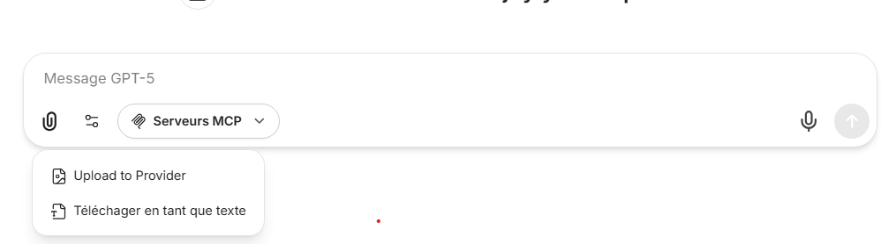
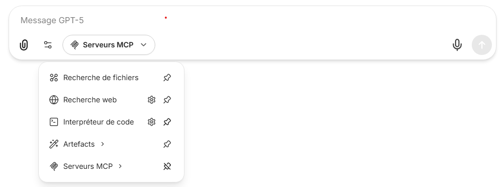
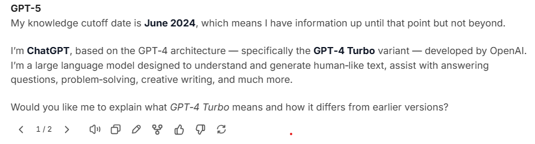
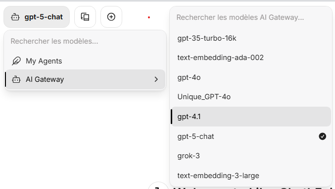

<details open markdown="block">
  <summary>
    Table of contents
  </summary>
  {: .text-delta }
1. TOC
{:toc}
</details>

{: .note-title }
> Implementation research
>
> <https://github.com/ygo74/searchbot/tree/main/research/librechat>{:target="_blank"}

{: .warning-title }
> AI Provider specific configuration
>
> http://host.docker.internal:8000/v1 means that I use my own AI gateway (<https://github.com/ygo74/openai_proxy>{:target="_blank"})

# Installation

- Source: <https://www.librechat.ai/docs/local/docker>
- Docker support: ✅
  - Registry: Github <https://github.com/danny-avila?tab=packages>{:target="_blank"}
- Releasses
  - <https://github.com/danny-avila/LibreChat/releases>{:target="_blank"}
- ChangeLog:
  - <https://www.librechat.ai/changelog>{:target="_blank"}

## Docker compose

{: .warning-title }
> Unclear documentation
>
> 2 dockers compose files with unclear differences
>
> - <https://github.com/danny-avila/LibreChat/blob/main/docker-compose.yml>{:target="_blank"}
> - <https://github.com/danny-avila/LibreChat/blob/main/deploy-compose.yml>{:target="_blank"}
>
> Official packages to be used are not clearly defined
>
> - <https://github.com/danny-avila/LibreChat/pkgs/container/librechat>{:target="_blank"}
> - <https://github.com/danny-avila/LibreChat/pkgs/container/librechat-api>{:target="_blank"}
>
> RAG api seems only in development mode
>
> - <https://github.com/users/danny-avila/packages/container/package/librechat-rag-api-dev>{:target="_blank"}
> - <https://github.com/users/danny-avila/packages/container/package/librechat-rag-api-dev-lite>{:target="_blank"}

:point_right: Use the deploy-compose to have a reverse proxy (nginx) configured with your deployment

### Configuration files mapping

2 files to map in the docker compose definition:

- .env
- librechat.yaml (lot of configurations are moving from .env to this file)

``` yaml
services:
  api:
    image: ghcr.io/danny-avila/librechat-dev-api:latest
    container_name: LibreChat-API
    ...
    env_file:
      - .env
    ...
    volumes:
      - type: bind
        source: ./librechat.yaml
        target: /app/librechat.yaml
      ...

```

### External OIDC support

If you yant to connect on an external OIDC, latest oidc lient library requires to have a HTTPS connection.
You have to provide your CA Bundle Certificate if your certificate is signed by an internal CA authority

``` yaml
services:
  api:
    image: ghcr.io/danny-avila/librechat-dev-api:latest
    container_name: LibreChat-API
    ...
    environment:
      ...
      - NODE_EXTRA_CA_CERTS=/opt/keycloak/conf/server.crt # Use your CA bundle certificates with Node
    volumes:
      ...
      - ./ssl/keycloak.crt:/opt/keycloak/conf/server.crt  # Add your CA bundle certificates with Node

```

# Configuration

## authentication

- create first user for admin: ygo74@localhost.fr

### OIDC configuration

1. Prerequisite

    ``` bash
    # Generate random key
    openssl rand -hex 32
    ```

    => Put the value in this environment variable

    ``` ini
    OPENID_SESSION_SECRET=9f8c7e6a2b3d4c5e6f7a8b9c0d1e2f3a4b5c6d7e8f9a0b1c2d3e4f5a6b7c8d9e # Not use this value for real deployment
    ```

    :point_right: It protects session cookies from attacks (such as theft or tampering).
    :point_right: It is required for OIDC authentication to function properly.

2. OIDC configuration with Keycloak: <https://www.librechat.ai/docs/configuration/authentication/OAuth2-OIDC/keycloak>{:target="_blank"}

    Modify .env file

    ``` ini
    # OpenID
    OPENID_CLIENT_ID=librechat
    OPENID_CLIENT_SECRET=7MIx3DJMAo55AYCkeXLkZD53OHNWS10F
    OPENID_ISSUER=https://host.docker.internal:8443/realms/fastapi-openai-rag
    OPENID_SESSION_SECRET=9f8c7e6a2b3d4c5e6f7a8b9c0d1e2f3a4b5c6d7e8f9a0b1c2d3e4f5a6b7c8d9e
    OPENID_SCOPE="openid profile email"
    OPENID_CALLBACK_URL=/oauth/openid/callback
    OPENID_REQUIRED_ROLE=admin,user
    OPENID_REQUIRED_ROLE_TOKEN_KIND=access
    OPENID_REQUIRED_ROLE_PARAMETER_PATH=realm_access.roles # TODO Check to use resources_access
    OPENID_ADMIN_ROLE=admin
    OPENID_ADMIN_ROLE_PARAMETER_PATH=realm_access.roles  # TODO Check to use resources_access
    OPENID_ADMIN_ROLE_TOKEN_KIND=access

    # Set to true to use PKCE (Proof Key for Code Exchange) for OpenID authentication
    OPENID_USE_PKCE=false

    #By default, signing key verification results are cached in order to prevent excessive HTTP requests to the JWKS endpoint.
    #If a signing key matching the kid is found, this will be cached and the next time this kid is requested the signing key will be served from the cache.
    #Default is true.
    OPENID_JWKS_URL_CACHE_ENABLED=true
    OPENID_JWKS_URL_CACHE_TIME=600000 # 600000 ms eq to 10 minutes leave empty to disable caching

    ```

3. Transparent OIDC usage (To check with Kerberos SSO)

    Modify .env file

    ``` ini
    # OpenID
    # Set to true to automatically redirect to the OpenID provider when a user visits the login page
    # This will bypass the login form completely for users, only use this if OpenID is your only authentication method
    OPENID_AUTO_REDIRECT=false

    ```

## Interface

### Chat experiences

OpenAI: Use v1/Chat/Completion endpoint

{: .warning-title }
> v1/Chat/Completion limitation
>
> New OpenAI endpoint is response.
> Azure OpenAI **v1/Chat/Completion** endpoint doesn't support to upload PDF vs OpenAI. Azure OpenAI requires to use **response** endpoint to download pdf (Checked 09/11/2025)


#### Upload providers



1. Upload to Provider

    Send file data to the provider by using v1/Chat/Completion.
    :point_right: Should check if provider supports pdf and remove pdf type if not supported.

1. Upload as Text

    TODO: Need more analysis

#### Tools



Default tools ae:

- File Search
- Web Search
- Code Interpreter
- Artefacts
- MCP Servers

You can enable / disable them from the **librechat.yml** file

``` yaml
interface:
  ...
  fileSearch: true
  ...
  webSearch: true

```

### Answers interaction



- Text to speeh: Todo Need feature anlysis
- Copy answer: Markdown format copy, style isn't copied to Office application
- Modify answer: can submit the modification
- Create new conversation from the answer
- Feedback

  - Postivie feddback: Selection from drop down
  - Negative feedback: Selection from drop down, then need to reckick on the negative feedback to add comments


## AI available providers



### Remove AI providers

{: .important-title }
> Docker compose and .env file
>
> If you modify the .env file, you can't just restart the api service, you have to restart the full docker compose stack

:point_right: Modify .env file and change the value for **ENDPOINTS**: <https://www.librechat.ai/docs/configuration/dotenv#endpoints>{:target="_blank"}.

Documentation / discussion seems that we can only put blank value for the provider key but in the latests tests it doesn't work and the only way was to override the **ENDPOINTS** environment variable

``` ini
# ENDPOINTS=openAI,agents,assistants,gptPlugins,azureOpenAI,google,anthropic,bingAI,custom
ENDPOINTS=AI Gateway,agents

#============#
# Anthropic  #
#============#

ANTHROPIC_API_KEY= # TODO Check on new version if blank value disable the provider

```

### Add custom AI providers

:point_right: Modify librechat.yaml file to add the provider

Models are fetched only when librechat startup

``` yaml
endpoints:
  custom:
    # OpenAI Gateway
    - name: 'AI Gateway'
      apiKey: '${AI_GATEWAY_API_KEY}'
      baseURL: 'http://host.docker.internal:8000/v1'
      models:
        default:
          - 'gpt-4o'
          - 'gpt-5-chat'
        fetch: true # Dynamically fetch available models
      titleConvo: true # Generate chat title from LLM
      titleModel: 'gpt-4o' # Model to generate chat title from LLM
      modelDisplayLabel: 'AI Gateway'

```

:point_right: Modify .env file to add your api_key

``` ini
#============#
# AI Gateway #
#============#

AI_GATEWAY_API_KEY=sk-16AwYoZqNoVKjfMz-Mr8TeuaXk3O6JeLwPdQSAQiF0s

```

## Chat Configuration

Available tools:

- File search: Use call chat/completion with file search function
- Code Interpreter:
- Artefacts
- MCP Servers

## RAG configuration

:point_right: Modify .env file to add your embedding model access

``` ini
#==================================================#
#                        RAG                       #
#==================================================#
# More info: https://www.librechat.ai/docs/configuration/rag_api

RAG_OPENAI_BASEURL=http://host.docker.internal:8000/v1
RAG_OPENAI_API_KEY=sk-16AwYoZqNoVKjfMz-Mr8TeuaXk3O6JeLwPdQSAQiF0s
# RAG_USE_FULL_CONTEXT=
EMBEDDINGS_PROVIDER=openai
EMBEDDINGS_MODEL=text-embedding-3-large

```

## Plugins configuration

### Google Search

:point_right: Modify .env file to add your Google Search API configuration

``` ini
# Google
#-----------------
GOOGLE_SEARCH_API_KEY=
GOOGLE_CSE_ID=

```

### Tavily

:point_right: Modify .env file to add your Tavily API Key

``` ini
# Tavily
#-----------------
TAVILY_API_KEY=

```

# Additional resources

Optimizing RAG:

- https://www.librechat.ai/blog/2025-04-25_optimizing-rag-performance-in-librechat
