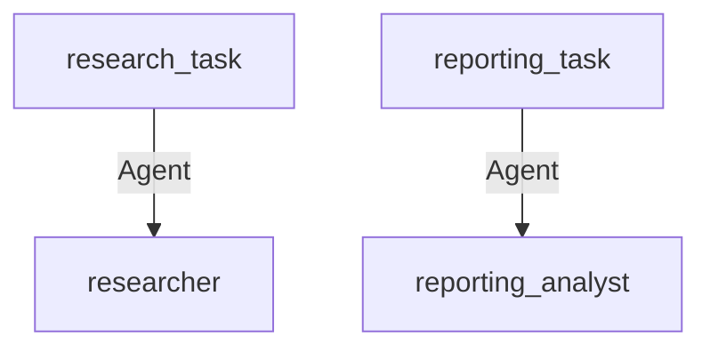

# Advanced Configuration and Customization Guide

This guide provides a comprehensive overview of how developers can customize agent behaviors and task parameters in the 'Get-Started' project, which facilitates interactions with language models using Azure's GPT-based models. The project employs a multi-agent system to manage tasks and roles efficiently.

## Overview

The configuration files `agents.yaml` and `tasks.yaml` are central to customizing the behavior of agents and defining task parameters. Understanding and modifying these files allow developers to tailor the system's functionality to their specific needs.

## Prerequisites

- Familiarity with YAML syntax and configuration management is required.

## Configuration Files

### agents.yaml

This file defines the roles and goals of different agents within the system. Each agent is characterized by its role, goal, and backstory, which guide its behavior in task execution.

Example structure from `agents.yaml`:

```yaml
researcher:
  role: >
    {topic} Senior Data Researcher
  goal: >
    Uncover cutting-edge developments in {topic}
  backstory: >
    You're a seasoned researcher with a knack for uncovering the latest
    developments in {topic}. Known for your ability to find the most relevant
    information and present it in a clear and concise manner.

reporting_analyst:
  role: >
    {topic} Reporting Analyst
  goal: >
    Create detailed reports based on {topic} data analysis and research findings
  backstory: >
    You're a meticulous analyst with a keen eye for detail. You're known for
    your ability to turn complex data into clear and concise reports, making
    it easy for others to understand and act on the information you provide.
```

### tasks.yaml

This file describes the tasks that agents are expected to perform. Each task specifies a description, expected output, and the agent responsible for execution.

Example structure from `tasks.yaml`:

```yaml
research_task:
  description: >
    Conduct a thorough research about {topic}
    Make sure you find any interesting and relevant information given
    the current year is 2024.
  expected_output: >
    A list with 10 bullet points of the most relevant information about {topic}
  agent: researcher

reporting_task:
  description: >
    Review the context you got and expand each topic into a full section for a report.
    Make sure the report is detailed and contains any and all relevant information.
  expected_output: >
    A fully fledged report with the main topics, each with a full section of information.
    Formatted as markdown without '```'
  agent: reporting_analyst
```

## Customization Instructions

To customize agent behaviors or task parameters:

1. **Identify the Agent or Task**: Locate the relevant section in either `agents.yaml` or `tasks.yaml`.
2. **Modify Parameters**: Update the role, goal, or description fields to suit your requirements.
3. **Save Changes**: Ensure all changes are saved correctly in YAML format.
4. **Restart System**: Apply changes by restarting the system or reloading configurations if supported.

## Visual Representation

Below is a mermaid diagram representing the relationship between agents and tasks within the system:



This diagram illustrates how tasks are assigned to specific agents based on their roles defined in the configuration files.

By following this guide, developers can effectively customize the 'Get-Started' project to meet specific requirements and optimize task management using Azure's GPT-based models.