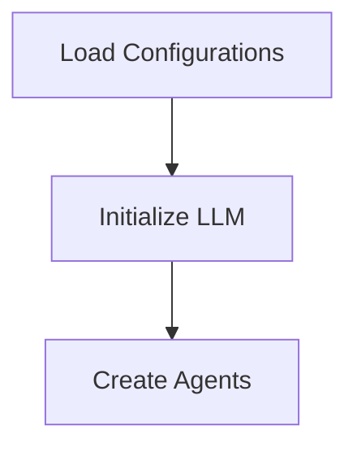
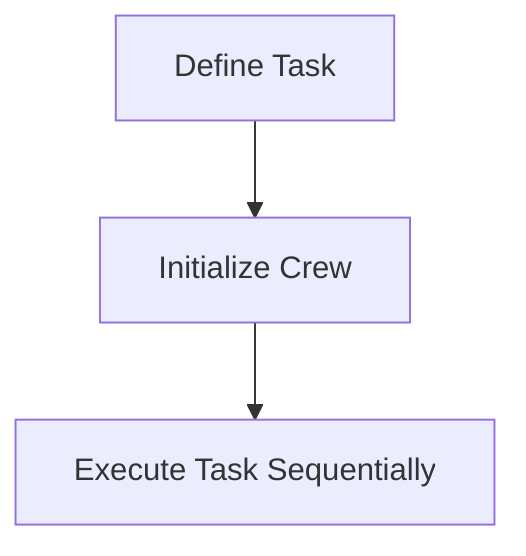

# Core Workflows and Data Flows

This document provides a detailed walkthrough of the core workflows and data flows within the `Get-Started` project, which facilitates interactions with Azure's GPT-based models using a multi-agent system. It explains how tasks are processed, highlighting agent initialization, task execution, and data movement through the system.

## Prerequisites

- Understanding of system architecture and agent-based systems.
- Familiarity with Python programming and YAML configuration files.

## Agent Initialization

Agent initialization is a crucial part of setting up the multi-agent system. The project uses the `Agent` class to create agents based on configurations loaded from YAML files.

```python
from crewai import Agent

# Creating an Agent
web_search_agent = Agent(
    config=agents_config['researcher'],
    verbose=True,
    llm=llm
)
```

### Workflow Diagram



## Task Execution

Tasks in the system are defined using the `Task` class, which includes specific configurations for execution. These tasks are managed by a `Crew`, which orchestrates the sequence and execution of tasks.

```python
from crewai import Task, Crew, Process

# Creating Tasks
search_task = Task(
    config=tasks_config['research_task']
)

# Executing Tasks with a Crew
agents_crew = Crew(
    agents=[web_search_agent],
    tasks=[search_task],
    process=Process.sequential,
    verbose=True
)

result = agents_crew.kickoff(inputs={'topic': 'AI LLMs'})
print(result)
```

### Workflow Diagram



## Configuration Setup

Configuration files for agents and tasks are stored in YAML format and are essential for defining roles and parameters for the system.

- **Agents Configuration:** `config/agents.yaml`
- **Tasks Configuration:** `config/tasks.yaml`

### Example Configuration

```yaml
# Example from agents.yaml
researcher:
  role: "Researcher"
  goal: "Conduct thorough research on AI topics"
```

### Loading Configurations

```python
import yaml

# Load configurations from YAML files
files = {'agents': 'Get-Started/config/agents.yaml', 'tasks': 'Get-Started/config/tasks.yaml'}
configs = {}
for config_type, file_path in files.items():
    with open(file_path, 'r') as file:
        configs[config_type] = yaml.safe_load(file)
```

This documentation outlines the key components and workflows in the `Get-Started` project, providing a comprehensive guide for developers to understand task processing within this multi-agent framework.