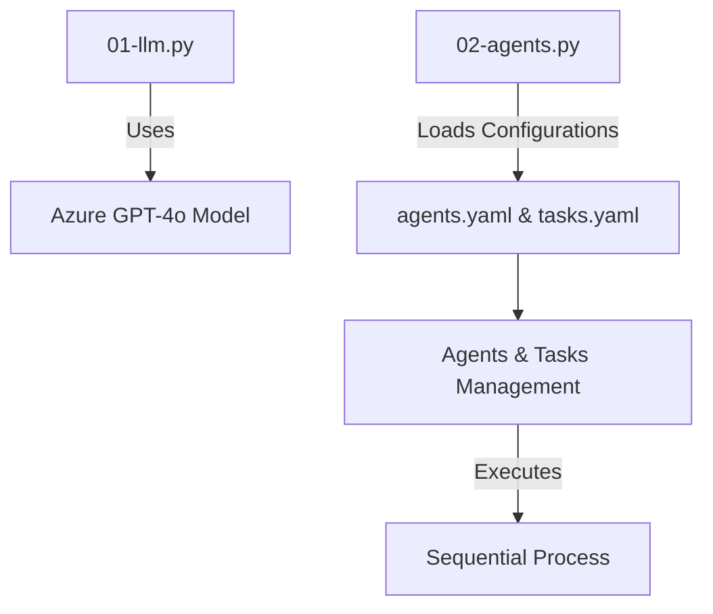

# Getting Started Guide

## Project Overview

The 'Get-Started' project facilitates interactions with language models using Azure's GPT-based models. It leverages a multi-agent system to efficiently manage tasks and roles.

## Prerequisites

- Access to Azure services.
- Basic command line knowledge.

## Setup Instructions

### Environment Setup

1. **Clone the Repository**
   Ensure you have cloned the repository to your local machine.

2. **Install Dependencies**
   Navigate to the project directory and install the required Python packages using pip:
   ```bash
   pip install -r requirements.txt
   ```

3. **Set Environment Variables**
   Create a `.env` file in the root directory of the project and add your Azure API credentials:
   ```plaintext
   AZURE_API_BASE=your_azure_api_base_url
   AZURE_API_KEY=your_azure_api_key
   ```

### Configuration Files

The project uses YAML configuration files located in the `config` directory:

- `agents.yaml`: Defines agent roles, goals, and backstories.
- `tasks.yaml`: Describes tasks, expected outputs, and associated agents.

## Running the Scripts

### Running `01-llm.py`

This script interacts with Azure's GPT-based models to translate text.

```bash
python 01-llm.py
```

**Example Code:**
```python
from crewai import LLM
from dotenv import load_dotenv
import os

load_dotenv()
messages = [{"content": "Translate the following text to French: 'Hello, how are you?'", "role": "user"}]
llm = LLM(model="azure/gpt-4o", api_version="2024-06-01")
result = llm.call(messages)
print(result)
```

### Running `02-agents.py`

This script demonstrates a multi-agent system for managing tasks.

```bash
python 02-agents.py
```

**Example Code:**
```python
from crewai import LLM, Agent, Task, Crew, Process
import yaml

# Load configurations from YAML files
with open('config/agents.yaml', 'r') as file:
    agents_config = yaml.safe_load(file)
with open('config/tasks.yaml', 'r') as file:
    tasks_config = yaml.safe_load(file)

web_search_agent = Agent(config=agents_config['researcher'])
search_task = Task(config=tasks_config['research_task'])

agents_crew = Crew(agents=[web_search_agent], tasks=[search_task], process=Process.sequential)
result = agents_crew.kickoff(inputs={'topic': 'AI LLMs'})
print(result)
```

## Visualizing Component Relationships



This guide should help developers quickly set up their environment and start working with the project.