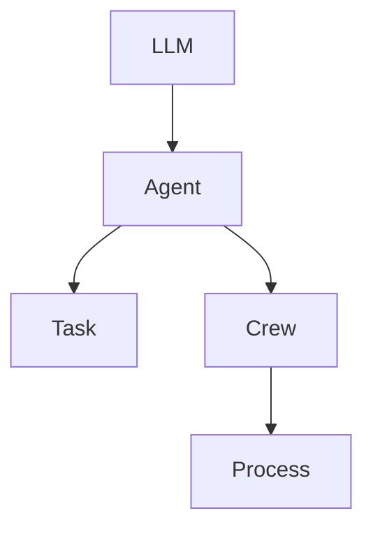

# High-Level Component Interactions in Get-Started Project

## Overview

This document outlines the high-level interactions between various components in the 'Get-Started' project, which facilitates interactions with language models using Azure's GPT-based models. The project employs a multi-agent system to manage tasks and roles efficiently.

## Components and Their Interactions

### LLM (Language Learning Model)

The `LLM` component is responsible for interfacing with Azure's GPT-based models. Below is an example of how the `LLM` is configured in the `01-llm.py` file:

```python
from crewai import LLM

llm = LLM(
    model="azure/gpt-4o",
    api_version="2024-06-01",
    temperature=0.7,
    timeout=120,
    max_tokens=4000,
    top_p=0.9,
    frequency_penalty=0.1,
    presence_penalty=0.1,
    seed=42
)

messages = [
    {
        "content": "Translate the following text to French: 'Hello, how are you?'",
        "role": "user"
    }
]

result = llm.call(messages)
print(result)
```

### Agent, Task, and Crew

In the `02-agents.py` file, Agents are created based on configurations loaded from YAML files. These agents are then organized into Crews to execute specific Tasks. Here's a simplified representation of these interactions:

```python
from crewai import Agent, Task, Crew, Process
import yaml

# Load configurations
with open('Get-Started/config/agents.yaml', 'r') as file:
    agents_config = yaml.safe_load(file)

with open('Get-Started/config/tasks.yaml', 'r') as file:
    tasks_config = yaml.safe_load(file)

# Create an Agent
web_search_agent = Agent(
    config=agents_config['researcher'],
    verbose=True,
    llm=llm
)

# Create a Task
search_task = Task(
    config=tasks_config['research_task']
)

# Create a Crew
agents_crew = Crew(
    agents=[web_search_agent],
    tasks=[search_task],
    process=Process.sequential,
    verbose=True
)

result = agents_crew.kickoff(inputs={'topic': 'AI LLMs'})
print(result)
```

### Mermaid Diagram of Component Interactions



## Setup Instructions

1. Ensure Python is installed.
2. Install required Python packages.
3. Configure your Azure environment by setting necessary environment variables.
4. Run the scripts `01-llm.py` and `02-agents.py` to see the components in action.

This documentation provides a high-level view of component interactions within the 'Get-Started' project, illustrating how LLMs, Agents, Tasks, and Crews work together to achieve project goals.