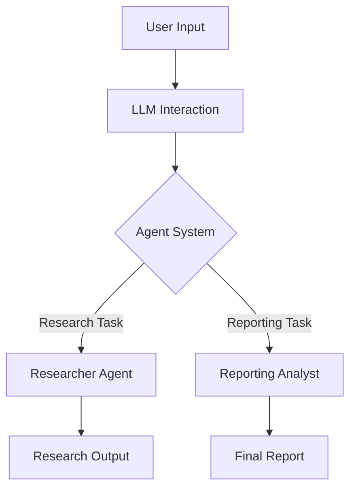

# Project Overview and Purpose

## Introduction
The 'Get-Started' project is designed to facilitate structured interactions with Azure's GPT-based models through a multi-agent system. It aims to streamline the process of managing tasks and roles efficiently by leveraging the capabilities of advanced language models. This documentation provides an overview of the project's objectives, architecture, and key functionalities.

## Prerequisites
To fully understand this project, a basic understanding of language models and multi-agent systems is recommended.

## Architecture Overview

### Language Model Interaction
The core functionality revolves around interacting with Azure's GPT-based models. The `01-llm.py` script provides an example setup for querying these models with specific parameters such as temperature, max tokens, and more. This allows for customizable and dynamic responses based on user inputs.

#### Code Example
```python
from crewai import LLM

llm = LLM(
    model="azure/gpt-4o",
    api_version="2024-06-01",
    temperature=0.7,
    max_tokens=4000,
)

messages = [{"content": "Translate to French: 'Hello, how are you?'", "role": "user"}]
result = llm.call(messages)
print(result)
```

### Multi-Agent System
The project employs a multi-agent system to handle tasks efficiently. Agents are defined with specific roles, goals, and backstories as specified in the `agents.yaml` configuration file. Tasks are detailed in the `tasks.yaml` file and are executed by designated agents.

#### Agent Configuration Example
```yaml
researcher:
  role: "AI Researcher"
  goal: "Uncover cutting-edge developments in AI"
  backstory: "You're a seasoned researcher..."
```

### Task Management
Tasks are managed sequentially or hierarchically using the `Crew` class from the `crewai` library. Each task is associated with an agent responsible for its completion.

#### Task Configuration Example
```yaml
research_task:
  description: "Conduct a thorough research about AI"
  expected_output: "A list with 10 bullet points..."
  agent: researcher
```

### Component Interaction Diagram
Below is a mermaid diagram illustrating the flow of information between components in the system:



## Setup Instructions
1. **Environment Setup**: Ensure that all environment variables are correctly set up by using a `.env` file.
2. **Install Dependencies**: Use a package manager like `pip` to install necessary libraries such as `crewai`, `dotenv`, and `yaml`.
3. **Configuration Files**: Verify that the `agents.yaml` and `tasks.yaml` files are properly configured for your use case.

## Conclusion
The 'Get-Started' project offers a robust framework for interacting with language models using a multi-agent system. By following this guide, developers can understand the project's objectives, setup, and execution flow, enabling efficient task management through advanced AI technologies.