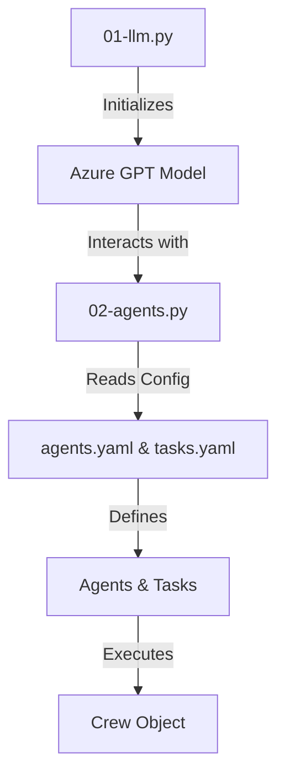

# System Architecture and Design Decisions

## Overview

This document provides a detailed explanation of the system architecture and key design decisions for the "Get-Started" project. This project leverages Azure's GPT-based models to facilitate interactions with language models through a multi-agent system designed to efficiently manage tasks and roles.

## Architecture

The system architecture is structured around two main Python scripts and a set of YAML configuration files. The primary components of this architecture include:

### Main Scripts

- **01-llm.py**: This script initializes the interaction with an Azure-based GPT model. It loads environment variables using `dotenv`, configures the model with specific parameters, and sends user-defined messages to receive responses.

  ```python
  from crewai import LLM
  from dotenv import load_dotenv
  import os

  load_dotenv()
  llm = LLM(
      model="azure/gpt-4o",
      api_version="2024-06-01",
      temperature=0.7,
      timeout=120,
      max_tokens=4000,
      top_p=0.9,
      frequency_penalty=0.1,
      presence_penalty=0.1,
      seed=42
  )

  result = llm.call(messages)
  print(result)
  ```

- **02-agents.py**: This script sets up a multi-agent system using the `crewai` library. It reads configurations from YAML files, defines agents, and assigns tasks. The tasks are executed through a crew object, managing task execution processes.

  ```python
  from crewai import Agent, Task, Crew, Process
  import yaml

  with open('Get-Started/config/agents.yaml', 'r') as file:
      agents_config = yaml.safe_load(file)

  web_search_agent = Agent(config=agents_config['researcher'], verbose=True, llm=llm)
  search_task = Task(config=tasks_config['research_task'])

  agents_crew = Crew(
      agents=[web_search_agent],
      tasks=[search_task],
      process=Process.sequential,
      verbose=True
  )

  result = agents_crew.kickoff(inputs={'topic': 'AI LLMs'})
  print(result)
  ```

### Configuration Files

- **agents.yaml**: Defines agent roles such as "Senior Data Researcher" and "Reporting Analyst," detailing their goals and backstories.

  ```yaml
  researcher:
    role: >
      {topic} Senior Data Researcher
    goal: >
      Uncover cutting-edge developments in {topic}
    backstory: >
      You're a seasoned researcher with a knack for uncovering the latest developments in {topic}.
  ```

- **tasks.yaml**: Outlines task descriptions, expected outputs, and assigns tasks to specific agents.

  ```yaml
  research_task:
    description: >
      Conduct a thorough research about {topic}
    expected_output: >
      A list with 10 bullet points of the most relevant information about {topic}
    agent: researcher
  ```

## Design Decisions

The design of this system focuses on modularity and scalability, allowing for easy updates to model parameters and agent/task configurations through YAML files. The use of the `crewai` library facilitates a flexible multi-agent system capable of managing complex workflows.

### Mermaid Diagram

Below is a mermaid diagram representing the component relationships and flow within the system:



## Setup Instructions

1. Ensure Python is installed on your machine.
2. Install necessary Python packages using pip:
   ```bash
   pip install crewai dotenv pyyaml
   ```
3. Set up your Azure API credentials in a `.env` file.
4. Run `01-llm.py` to test language model interactions.
5. Execute `02-agents.py` to initiate the multi-agent system and perform tasks.

This documentation provides a comprehensive understanding of the system architecture and design decisions for developers working with the "Get-Started" project.