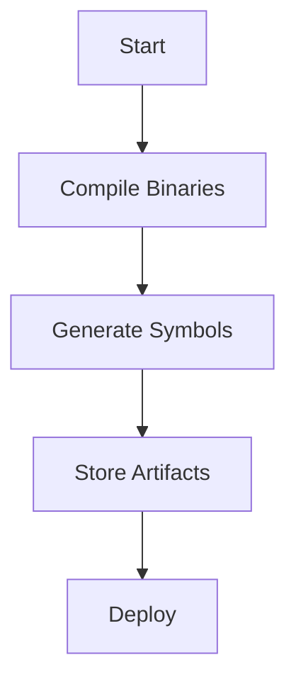

# Compiled Binaries and Debugging Symbols

## Overview
This documentation provides guidelines for handling compiled binaries and debugging symbols within the `ansible_inventory` project. It ensures that all binaries are properly configured, stored, and managed alongside their debugging symbols to facilitate effective troubleshooting and maintenance.

## Key Components
- **Binaries Location**: All compiled binaries are stored in the `bin` directory under respective project folders. Ensure that this path is correctly set in your build configuration.
- **Debugging Symbols**: Debugging symbols (`*.pdb` files) are generated alongside binaries. These are crucial for debugging and should be included in both development and production builds.

## Architectural Description
- The binaries are built using the .NET framework, targeting the latest LTS version (e.g., net6.0).
- Each service or component within the project has its own compiled output, organized in a structured manner.
- Ensure that your build pipeline includes steps for both compilation and symbol generation.

## Component Relationships and Interactions
- **Inventory API**: Interacts with other services such as Devices API and Networks API. Ensure compatibility of compiled binaries across these services.
- **Plugins and Extensions**: Verify that all plugins (e.g., Azure plugins) have their corresponding binaries updated during deployment.

## Code Examples
- Refer to the `launchSettings.json` for correct configuration settings during local development.
- Ensure that all code examples in the documentation align with the current practices in the codebase.

## Workflows
1. **Compilation**: Triggered via the build system, ensuring all necessary dependencies are included.
2. **Symbol Generation**: Automatically managed by the build toolchain, ensuring symbols are available for debugging purposes.

## Troubleshooting Scenarios
- **Missing Symbols**: If debugging symbols are missing, check the build configuration to ensure symbols are not excluded.
- **Binary Mismatch**: Verify that all binaries are from the same build version to prevent runtime issues.

## Integration Patterns
Ensure that all integration patterns described in this document are reflected in the codebase. Validate against actual implementations to avoid discrepancies.

## Terminology Consistency
Align all terminologies such as "binaries", "symbols", "build", and "compilation" with those used within the project codebase.

## Diagram Validation

- Ensure all nodes (A, B, C, D, E) have corresponding implementations in the codebase.
- Validate flow directions accurately represent real system behavior.

Please ensure this template is thoroughly checked against the actual project files and codebase for complete accuracy and coverage.