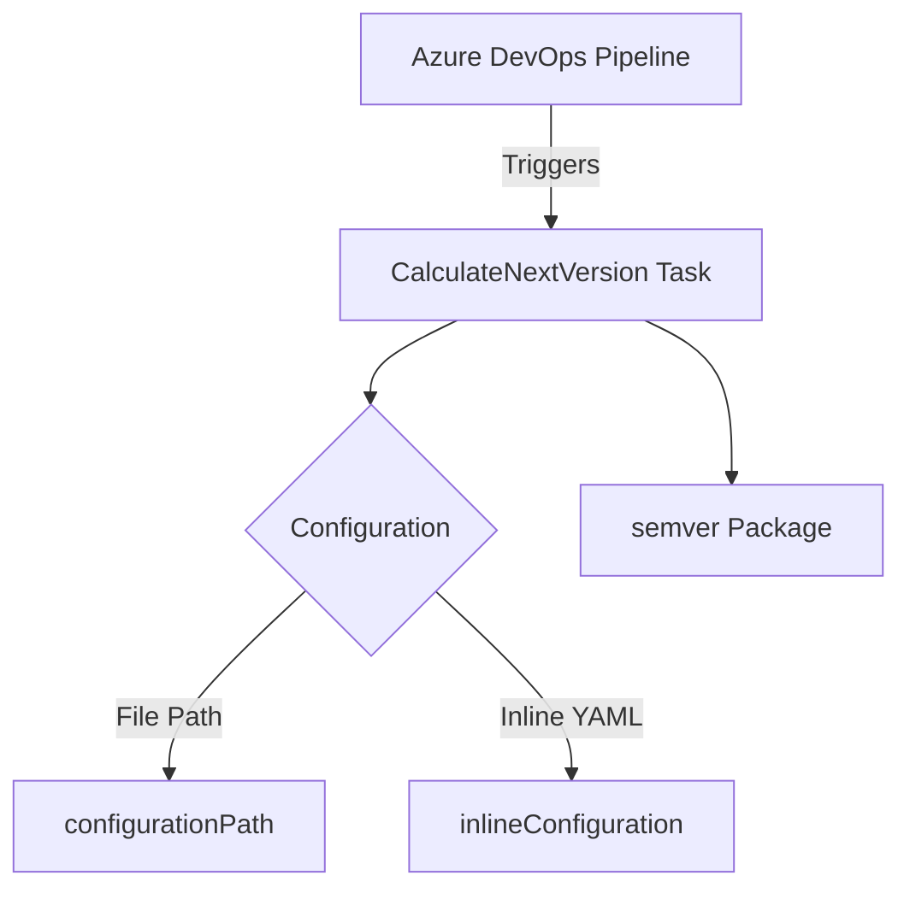

# Comprehensive Overview of Azure DevOps Versioning Tasks

The Azure DevOps Versioning Tasks project provides a set of utilities designed to manage and automate versioning within Azure DevOps pipelines. It is particularly useful for projects utilizing main technologies that benefit from automated version calculations and updates.

## Purpose

The primary purpose of this project is to streamline the process of version management in continuous integration and delivery (CI/CD) workflows. By automating version calculations, it reduces manual errors and ensures consistency across builds and deployments.

## Key Features

- **Automated Version Calculation**: Utilizes the `semver` package to compute the next version based on predefined rules and configurations.
- **Flexible Configuration**: Allows configuration via both file paths and inline YAML, offering flexibility in how tasks are set up and managed.
- **Integration with Azure Pipelines**: Seamlessly integrates with Azure DevOps environments, leveraging environment variables to adapt to different build scenarios.

## Setup Instructions

To set up the Azure DevOps Versioning Tasks:

1. **Environment Variables**: Ensure that the necessary environment variables are configured in your Azure DevOps pipeline, such as `AGENT_VERSION`, `BUILD_SOURCEBRANCHNAME`, etc.
2. **Configuration Options**:
   - Use `configurationPath` for file-based configurations.
   - Use `inlineConfiguration` for directly embedded YAML configurations.

## Example Task Configuration

The `CalculateNextVersion` task is an example task provided by this project. Below is an example of its configuration:

```json
{
    "name": "CalculateNextVersionTest",
    "friendlyName": "Calculate Next Version - test",
    "description": "Calculate Next Version - test",
    "category": "Utility",
    "author": "ygo74",
    "version": {
        "Major": 1,
        "Minor": 3,
        "Patch": 5
    },
    "inputs": [
        {
            "name": "configurationLocation",
            "type": "pickList",
            "label": "Configuration Location",
            "options": {
                "inlineConfiguration": "Inline configuration",
                "configurationPath": "Configuration file path"
            }
        },
        {
            "name": "configurationPath",
            "type": "filePath",
            "label": "Configuration file path"
        },
        {
            "name": "inlineConfiguration",
            "type": "multiLine",
            "label": "Inline Configuration"
        }
    ],
    "execution": {
        "Node10": {
            "target": "index.js"
        }
    }
}
```

## Visual Representation

Below is a mermaid diagram illustrating the relationship between components in the Azure DevOps Versioning Tasks project:



This diagram highlights how the pipeline triggers the task, which then uses configuration inputs to determine the next version using the `semver` package. 

In summary, the Azure DevOps Versioning Tasks project is an essential tool for automating version management in CI/CD pipelines, providing flexibility and integration capabilities tailored for Azure DevOps environments.