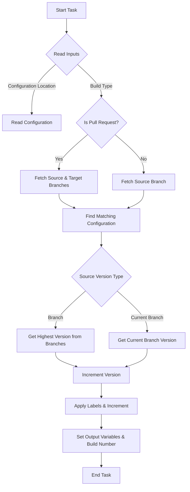

# Core Workflows and Data Flows

## Overview

This documentation provides insights into the core workflows and data flows within the Azure DevOps Versioning Tasks extension, focusing on task execution and inter-task interactions. The extension comprises tasks that manage versioning in Azure DevOps Pipelines.

### Prerequisites

- Knowledge of Azure DevOps pipelines is required.

## Calculate Next Version Task

### Purpose

The `CalculateNextVersionV1` task calculates the next version number for a project based on branch configuration, ensuring consistent versioning across different branches and pull requests.

### Workflow

The task follows these main steps:

1. **Initialization**: The task starts by reading mandatory inputs such as `configurationLocation` and `configurationPath`. It determines if the build is from a pull request or a standard branch build.

2. **Branch Configuration**: Depending on whether the build is from a pull request, it reads the source and target branches using Azure DevOps environment variables.

3. **Configuration Matching**: The task uses the branch information to find a matching configuration from the provided file or inline YAML.

4. **Version Calculation**:
   - If configured to fetch versions from branches, it identifies the branch with the highest version.
   - Alternatively, it calculates the current branch version and increments it based on commit counts.
   - The resulting version can be appended with labels and branch names as specified in the configuration.

5. **Output**: The calculated version is set as an output variable and updates the build number in Azure DevOps.

### Code References

- **Main Script**: [index.ts](src/CalculateNextVersionV1/index.ts)
- **Configuration Parsing**: [readConfigurationFile.ts](src/CalculateNextVersionV1/readConfigurationFile.ts)
- **Version Utilities**: [branchVersionUtils.ts](src/CalculateNextVersionV1/branchVersionUtils.ts)

### Mermaid Diagram

### Configuration

The task configuration is defined in a JSON schema:

- **`configurationLocation`**: Determines if the configuration is inline or file-based.
- **`configurationPath`**: Specifies the path to the configuration file.
- **`inlineConfiguration`**: Allows inline YAML configuration for quick setup.

For detailed setup, refer to the [task.json](src/CalculateNextVersionV1/task.json).

By understanding these workflows and data flows, developers can effectively utilize the `CalculateNextVersionV1` task within their Azure DevOps pipelines for streamlined version management.