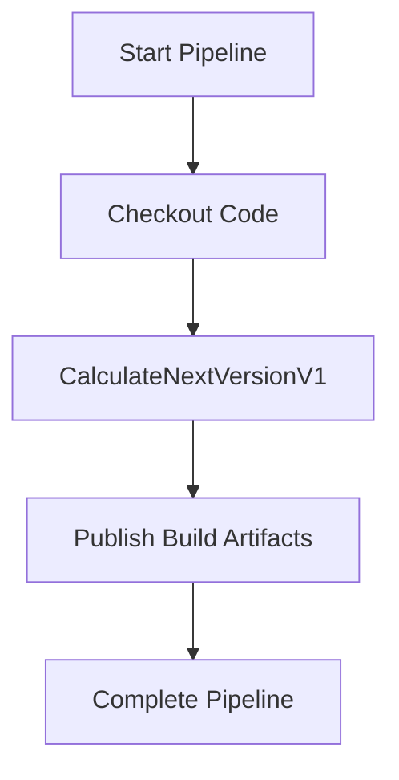

# Getting Started Guide for Azure DevOps Versioning Tasks

## Introduction

This guide will help you set up and use the Azure DevOps Versioning Tasks extension in your pipelines. The extension provides utilities to calculate and update versions for various technologies within Azure DevOps.

## Prerequisites

Before starting, ensure you have:

- Basic knowledge of Azure DevOps.
- Understanding of YAML syntax.

## Installation

To install the Azure DevOps Versioning Tasks extension:

1. Navigate to your Azure DevOps organization.
2. Go to the "Extensions" section.
3. Search for "Azure DevOps Versioning Tasks".
4. Click "Install" to add it to your organization.

## Configuration

The `CalculateNextVersionV1` task allows you to calculate the next version number based on your configuration. You can specify the configuration in two ways:

- **Inline Configuration**: Define your YAML configuration directly in the pipeline.
- **Configuration File**: Provide a path to a YAML configuration file.

### Task Configuration Example

Below is an example of how to use the `CalculateNextVersionV1` task in an Azure DevOps pipeline:

```yaml
- task: CalculateNextVersionV1@1
  inputs:
    configurationLocation: 'configurationPath' # or 'inlineConfiguration'
    configurationPath: '$(System.DefaultWorkingDirectory)/config.yaml'
    inlineConfiguration: |
      versionScheme: Semver
      strategy: File
```

## Usage Example

Here's how you can incorporate the task into your YAML pipeline:

```yaml
trigger:
- main

pool:
  vmImage: 'ubuntu-latest'

steps:
- checkout: self

- task: CalculateNextVersionV1@1
  inputs:
    configurationLocation: 'inlineConfiguration'
    inlineConfiguration: |
      versionScheme: Semver
      strategy: File
```

## Mermaid Diagram

Below is a mermaid diagram illustrating the workflow of the `CalculateNextVersionV1` task within a pipeline:



## Conclusion

By following this guide, you should be able to quickly set up and start using the Azure DevOps Versioning Tasks extension in your projects. For more detailed task-specific instructions, refer to the documentation provided within the extension's repository.