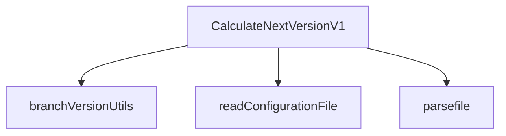
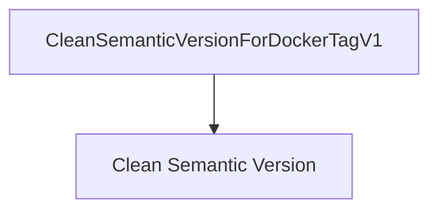
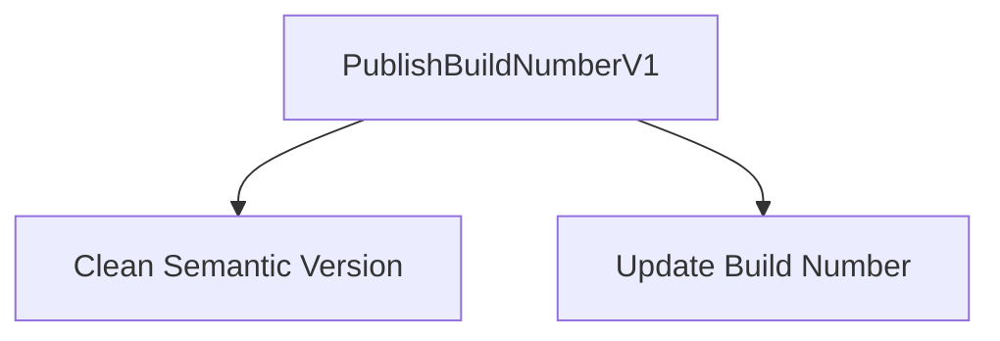

# High-Level Component Interactions

This document provides an overview of the interactions between major components in the Azure DevOps Versioning Tasks codebase. Understanding these interactions is crucial for debugging and extending the functionalities of the tasks.

## CalculateNextVersionV1

The `CalculateNextVersionV1` task is responsible for determining the next version number based on the source branch and configuration settings.

- **Dependencies**:
  - `parsefile`: Handles file parsing operations.
  - `branchVersionUtils`: Provides utilities for version calculations, including finding the highest version from branches.
  - `readConfigurationFile`: Reads and processes configuration files to determine branch-specific settings.

### Code Reference

```typescript
import * as parser from './parsefile';
import { getHighestVersionFromBranches, getCurrentVersionFromBranch } from './branchVersionUtils';
import { BranchConfiguration, findMatchingKey } from './readConfigurationFile';
```

### Component Interaction Diagram



## CleanSemanticVersionForDockerTagV1

This task cleans up a semantic version string by replacing `+` with `_`, making it suitable for Docker tags.

### Code Reference

```typescript
const cleanedVersion: string = currentVersion.replace(/\+/g, '_');
```

### Component Interaction Diagram



## PublishBuildNumberV1

The `PublishBuildNumberV1` task publishes the build number using semantic versioning and an optional unique counter. It cleans the version for OCI compliance.

### Code Reference

```typescript
let currentVersion: string = tl.getInput('semanticVersioning', true) || '';
const cleanedVersion: string = currentVersion.replace(/\+/g, '_');
```

### Component Interaction Diagram



## Conclusion

These tasks are designed to work together to streamline versioning in Azure DevOps pipelines. By understanding their interactions and dependencies, developers can effectively troubleshoot issues and implement extensions.