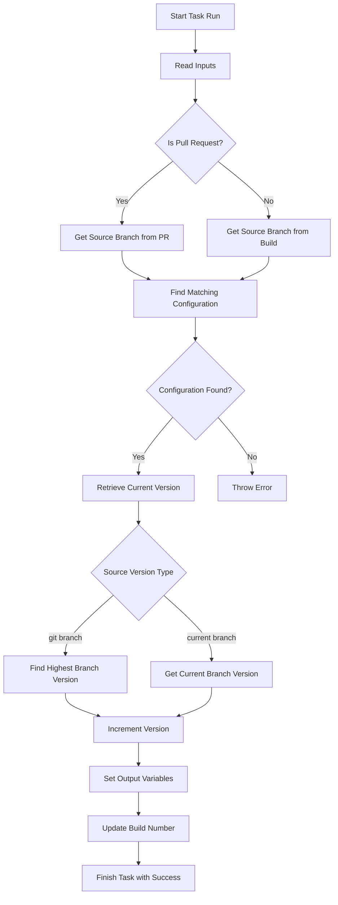

# System Architecture and Key Design Decisions for Azure DevOps Versioning Tasks

## Overview

This documentation outlines the system architecture and key design decisions for the Azure DevOps Versioning Tasks project. It provides developers with a clear understanding of the modular structure, core components, and the rationale behind significant design choices.

## Architecture

The Azure DevOps Versioning Tasks project is designed with a modular architecture. The primary focus is on version calculation and management within Azure DevOps pipelines. The main components of the project are organized into tasks, each responsible for a specific functionality.

### Core Components

1. **CalculateNextVersionV1**
   - **Purpose**: This task calculates the next version number based on branch and commit information.
   - **Key Files**:
     - `index.ts`: The entry point for the task, orchestrating the version calculation process.
     - `branchVersionUtils.ts`: Utility functions for branch version management.

2. **Utility Functions**
   - **getHighestVersionFromBranches**: Retrieves the highest version number from branches matching a given prefix.
   - **getCurrentVersionFromBranch**: Extracts the current version from a branch name.
   - **getCommitCount**: Counts the number of commits in a branch relative to the master.
   - **incrementPatchVersion**: Increments the patch version based on commit count.

### Interactions

The tasks interact with Azure DevOps environment variables and utilize Git commands to extract necessary information for version calculations. The calculated version is set as a variable in the pipeline and can update the build number.

## Design Decisions

### Modular Task Structure

Each task is encapsulated in its directory with a dedicated entry file (`index.ts`) and supporting utilities. This design promotes separation of concerns and makes it easier to maintain and extend individual tasks.

### Semantic Versioning

The project employs semantic versioning to ensure consistent and predictable version increments. The use of semver library functions simplifies version comparisons and increments.

### Environment Integration

Integration with Azure DevOps environment variables allows the tasks to dynamically respond to different build scenarios, such as pull requests or direct branch builds.

### Git Command Utilization

The use of Git commands enables accurate retrieval of branch information and commit counts, which are essential for calculating version numbers accurately.

## Mermaid Diagram

To visualize the interaction between components, here is a mermaid diagram illustrating the flow within `CalculateNextVersionV1`:

This diagram represents the logical flow and decision points within the `CalculateNextVersionV1` task, highlighting its integration with environment variables and Git operations.

## Conclusion

The Azure DevOps Versioning Tasks project is structured to provide flexible and reliable version management capabilities within Azure DevOps pipelines. By understanding its architecture and design decisions, developers can effectively utilize and extend the project to meet their specific needs.